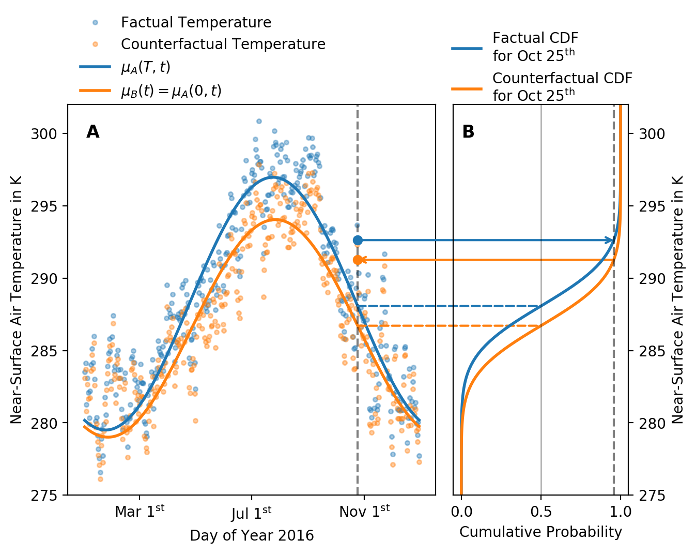

# ATTRICI - counterfactual climate for impact attribution

Code implementing the methods of as discussed in Mengel et al. (submitted) [insert link to preprint].

## Summary

Climate has changed over the past century due to anthropogenic greenhouse gas emissions. In parallel, societies and their environment have evolved rapidly. To identify the impacts of historical climate change on human or natural systems, it is therefore necessary to separate the effect of different drivers. By definition this is done by comparing the observed situation to a counterfactual one in which climate change is absent and other drivers change according to observations. As such a counterfactual baseline cannot be observed it has to be estimated by process-based or empirical models. We here present ATTRICI (ATTRIbuting Climate Impacts), an approach  to remove the signal of global warming from observational climate data to generate forcing data for the simulation of a counterfactual baseline of impact indicators. Our method identifies the interannual and annual cycle shifts that are correlated to global mean temperature change. We use quantile mapping to a baseline distribution that removes the global mean temperature related shifts to find counterfactual values for the observed daily climate data. Applied to each variable of two climate datasets, we produce two counterfactual datasets that are made available through the Inter-Sectoral Impact Model Intercomparison Project (ISIMIP) along with the original datasets. Our method preserves the internal variability of the observed data in the sense that observed (factual) and counterfactual data for a given day remain in the same quantile in their respective statistical distribution. That makes it possible to compare observed impact events and counterfactual impact events. Our approach adjusts for the long-term trends associated with global warming but does not address the attribution of climate change to anthropogenic greenhouse gas emissions.

## Approach

Preserving the events of the historical record is a key objective of the climate counterfactual presented here. In summary, we construct the counterfactual by removing shifts in the historical dataset that can be linked to global mean temperature change.

Our method relies on quantile mapping and thus on two statistical distributions: a distribution **A** that captures the evolution of the statistics of a climate variable due to climate change and a reference distribution **B** that approximates such evolution in the absence of climate change. Both distributions are dependent on time. Distribution **A** varies with a long-term global mean temperature trend, the yearly cycle, and a global-mean-temperature related distortion of the yearly cycle. The reference distribution **B** varies with the yearly cycle only. The type of the distribution depends on the climate variable and is the same for **A** and **B**.

The probabilistic model is illustrated for daily temperatures at an exemplary grid cell in panel A of Fig. 2. The difference between the expected values of distribution **A** (blue line) and **B** (orange line) is due to a vertical shift and a distortion of the  annual cycle. In panel B, the quantile mapping step is shown for an exemplary day. We obtain the percentile of the factual (i.e. observed) temperature (blue dot in panel A) at that day from the factual cumulative distribution function (CDF) (blue line in panel B). We then obtain the counterfactual temperature (orange dot in panel A) from the counterfactual CDF (orange line in panel B) at the same percentile.

*Figure 1: Illustration of quantile mapping sensitive to the annual cycle. Panel A shows factual (blue points) and counterfactual (orange points) daily mean near-surface air temperature for the year 2016 of the GSWP3-W5E5 for a single grid cell in the Mediterranean region at 43.25°N, 5.25°E. In panel A, the blue and orange lines show the temporal evolution of the expected value μ (50th percentile) of the factual and the counterfactual distribution. In panel B, the blue and orange lines show the factual and counterfactual cumulative distribution function (CDF) for a single day (October 25th, 2016). The large blue and orange points in panel A show the factual and counterfactual daily mean temperature on October 25th. They correspond to the 95th percentile in their respective distributions. *

### Variables

We model the different climatic variables using the statistical distributions listed below.

| Variable | Short name | Unit | Statistical distributions |
| -------- | ---------- | ---- | ----------------- |
| Daily Mean Near-Surface Air Temperature | tas | K | Gaussian |
| Daily Near-Surface Temperature Range | tasrange | K | Gaussian |
| Daily Near-Surface Temperature Skewness | tasskew | 1 | Gaussian |
|Daily Minimum Near-Surface Air Temperature | tasmin | K | Derived from tas, tasrange and tasskew |
| Daily Maximum Near-Surface Air Temperature | tasmax | K | Derived from tas, tasrange and tasskew |
| Precipitation | pr | kg  m-2 s-1 | Bernoulli-Gamma |
| Surface Downwelling Shortwave Radiation | rsds | W m-2 | Gaussian |
| Surface Downwelling Longwave Radiation | rlds | W m-2 | Gaussian |
| Surface Air Pressure | ps | Pa | Gaussian |
| Near-Surface Wind Speed | sfcWind | m s-1 | Weibull |
| Near-Surface Relative Humidity | hurs | % | Gaussian |
| Near-Surface Specific Humidity | huss | kg kg-1 | Derived from hurs ps and tas |

*Table 1: Specs of climate variables for the ISIMIP3b counterfactual climate datasets. The variables tasrange and tasskew are auxiliary variables to calculate tasmin and tasmax*

For tasmin and tasmax, we do not estimate counterfactual time series individually to avoid large relative errors in the daily temperature range as pointed out by (Piani et al. 2010). Following (Piani et al. 2010), we estimate counterfactuals of the daily temperature range tasrange = tasmax - tasmin and the skewness of the daily temperature tasskew = (tas - tasmin) / tasrange.

A counterfactual huss is derived from the counterfacual tas, ps and hurs using the equations of Buck (1981) as described in Weedon et al. (2010).
huss = f(tas, pr ,hurs)

## Usage

This code is currently taylored to run on the supercomputer at the Potsdam Institute for Climate Impact Research. Generalizing it into a package is ongoing work. We use the GNU compiler as the many parallel compile jobs through jobarrays and JIT compilation conflict with the few Intel licenses.

`module purge`

`module load compiler/gnu/7.3.0`

`conda activate yourenv`

Override the conda setting with: `export CXX=g++`

Adjust `settings.py`

For estimating parameter distributions (above step 1) and smaller datasets

`python run_estimation.py`

For larger datasets, produce a `submit.sh` file via

`python create_submit.py`

Then submit to the slurm scheduler

`sbatch submit.sh`

For merging the single timeseries files to netcdf datasets

`python merge_cfact.py`

### Running multiple instances at once

`conda activate yourenv`

In the root package directory.

`pip install -e .`

Copy the `settings.py`, `run_estimation.py`, `merge_cfact.py` and `submit.sh` to a separate directory,
for example `myrunscripts`. Adjust `settings.py` and `submit.sh`, in particular the output directoy, and continue as in Usage.

### Project Structure
* All general settings are defined in `settings.py`.
* The model can be run with the `run_estimation.py` script.
* Model definitions for different climate variables are specified in `attrici/models.py`
* The choice of a specific model for a variable is specified in `attrici/estimator.py`

### Calculating tasmin, tasmax and huss

Counterfactual _tasmin_ and _tasmax_ can be derived based on the counterfactual _tas_, _tasrange_ and _tasskew_.
Use 
`postprocessing/create_tasmin_tasmax.py`
with adjusted paths for the _tas_, _tasrange_ and _tasskew_ counterfactuals.

A counterfactual _huss_ can be derived from the counterfactual _hurs_, _ps_ and _tas_. Use
`postprocessing/derive_huss.sh`
with adjusted file names and the required time range.

## Install

We use the jobarray feature of slurm to run many jobs in parallel.
The configuration is very much tailored to the PIK supercomputer at the moment. Please do

`conda config --add channels conda-forge`

`conda create -n isi-cfact pymc3==3.7 python==3.7`

`conda activate isi-cfact`

`conda install netCDF4 pytables matplotlib arviz`

`pip install func_timeout`

You may optionally
`cp config/theanorc ~/.theanorc`

## Credits

We rely on the [pymc3](https://github.com/pymc-devs/pymc3) package for probabilistic programming (Salvatier et al. 2016).

The code on Bayesian estimation of parameters in timeseries with periodicity in PyMC3 is inspired and adopted from [Ritchie Vink's](https://www.ritchievink.com) [post](https://www.ritchievink.com/blog/2018/10/09/build-facebooks-prophet-in-pymc3-bayesian-time-series-analyis-with-generalized-additive-models/) on Bayesian timeseries analysis with additive models.

## License

This code is licensed under GPLv3, see the LICENSE.txt. See commit history for authors.

## References
- Buck, A.L.:New Equations for Computing Vapor Pressure and Enhancement Factor, J. Appl. Meteorol., 20, 1527–1532, 1981.
- Piani, C., Weedon, G. P., Best, M., Gomes, S. M., Viterbo, P.,
Hagemann, S., and Haerter, J. O.: Statistical bias correction
of global simulated daily precipitation and temperature for the
application of hydrological models, J. Hydrol., 395, 199–215,
https://doi.org/10.1016/j.jhydrol.2010.10.024, 2010.
- Salvatier J., Wiecki T.V., Fonnesbeck C. (2016) Probabilistic programming in Python using PyMC3. PeerJ Computer Science 2:e55 DOI: 10.7717/peerj-cs.55.
- Weedon, G. P., Gomes, S., Viterbo, P., Österle, H., Adam, J. C., Bellouin, N., Boucher, O., and Best, M.: The WATCH forcing data 1958–2001: A meteorological forcing dataset for land surface and hydrological models, in: Technical Report no 22., available at: http://www.eu-watch.org/publications/technical-reports (last access: July 2016), 2010.
